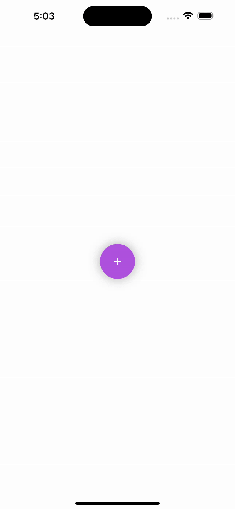

# 🎯 SwiftUI Radial Menu with Floating Action Button Animation

This SwiftUI project showcases a beautifully animated **Radial Menu** triggered by a central **Floating Action Button (FAB)** — a modern UI pattern commonly used in mobile apps. Tapping the FAB reveals a circular layout of customizable action buttons, each with smooth animation and clean design.

---

## 📸 Demo



> ✨ Built entirely with SwiftUI — no third-party libraries!

---

## 📚 What You’ll Learn

- How to create a floating action button (FAB) in SwiftUI  
- Layering views with `ZStack`  
- Using `@State` and `.offset()` for animation  
- Circular layout with trigonometric calculations  
- Smooth expand/collapse animation with `.spring()`  
- Building reusable UI components  

---

## 📂 Project Structure

```
📁 RadialMenuSwiftUI/
├── RadialMenu.swift         # Main view with FAB and radial buttons
├── RadialMenuButton.swift   # Model for each button (icon, color, action)
├── RadialMenu.gif           # Demo animation preview
└── README.md                # Project documentation
```

---

## 🛠️ How to Run

1. Clone the repository:
   ```bash
   git clone https://github.com/UpendraVerma/RadialMenuSwiftUI.git
   ```

2. Open the project in Xcode:
   ```bash
   open RadialMenuSwiftUI.xcodeproj
   ```

3. Run the project on any iPhone Simulator or physical device (iOS 15+)

---

## ✏️ Customization Tips

- ➕ Add or remove buttons in the radial menu array  
- 🎨 Change the colors and SF Symbols for each button  
- 📐 Adjust the radius or animation delay for different effects  
- 🔁 Use this as a base for more complex radial or context menus  

---

## 👨‍💻 Author

Created by **Upendra Verma**  
🔗 [https://github.com/UpendraVerma](https://github.com/UpendraVerma)

---

## 📄 License

This project is licensed under the [MIT License](LICENSE)

---

## 🙌 Like it?

If you found this helpful, feel free to ⭐ star the repo, fork it, and share with fellow developers!
